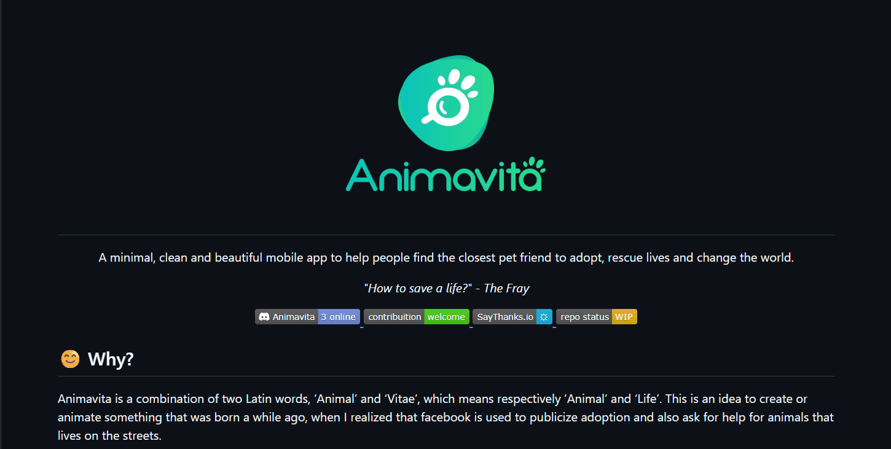

# Projeto com README
Um projeto de teste com arquivo README  🚀
[](https://www.google.com/)

## Tecnologias utilizadas
- HTML
- CSS
- JavaScript

## Como utilizar

1 - Clone o projeto
```
git clone <url>
```

2 - Acesse a pagina do projeto
```
cd repositorio-com-readme
